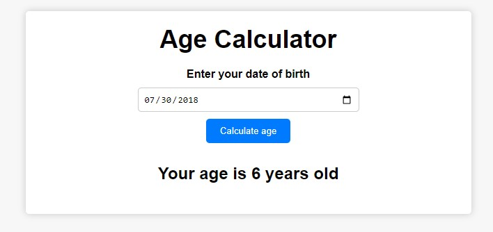
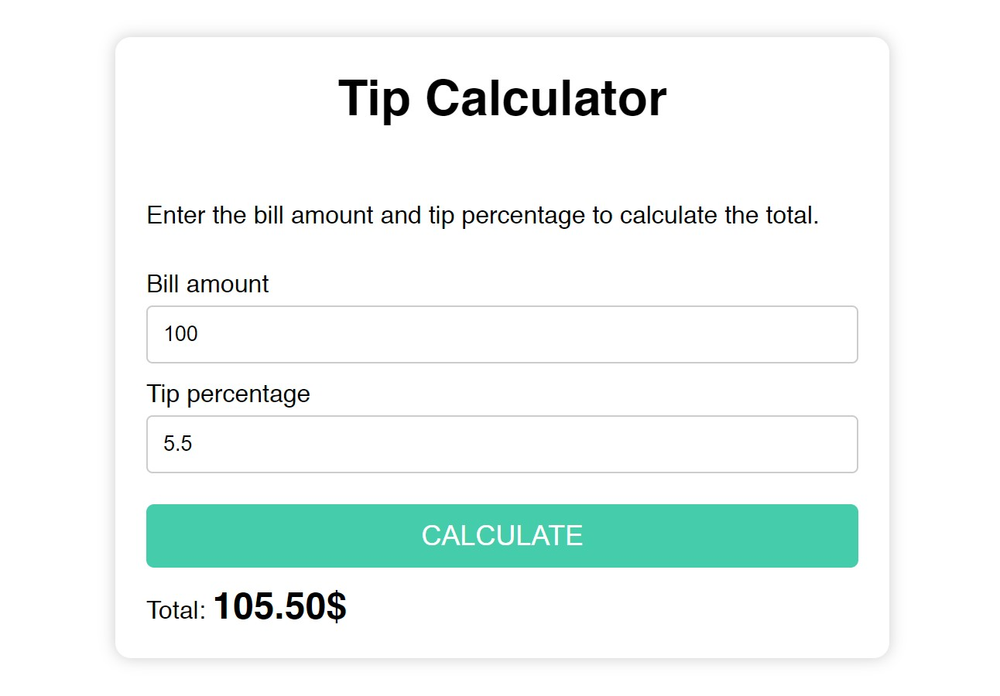
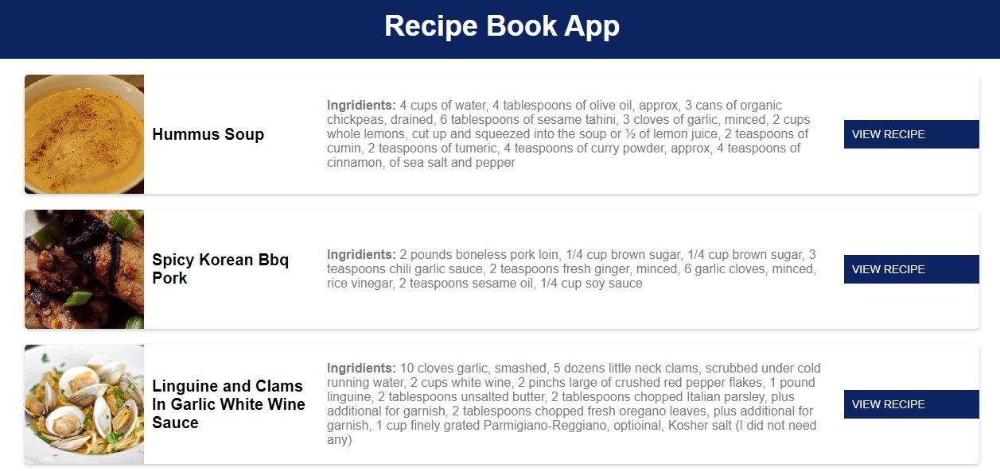
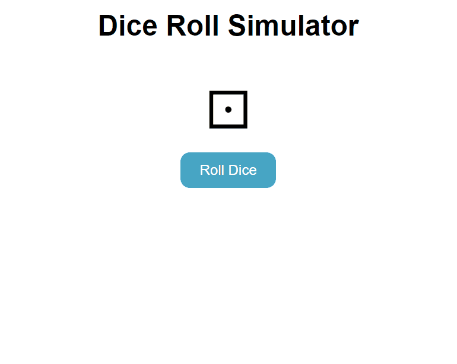
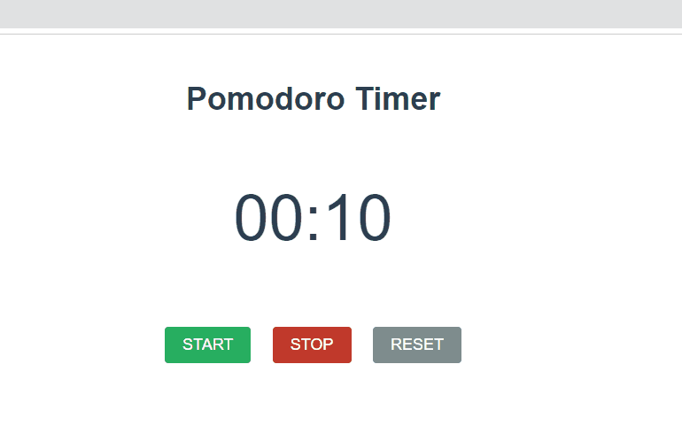

# HTML | CSS | JS | Build 60 projects to learn HTML CSS JavaScript | Vanilla JavaScript projects

## Project 1 | Age Calculator

## Project 2 | Tip Calculator

## Project 3 | Recipe Book App

**Food API used** - [spoonacular API](https://spoonacular.com/)

## Project 4 | Dice Roll Simulator

## Project 5 | Pomodoro Timer

